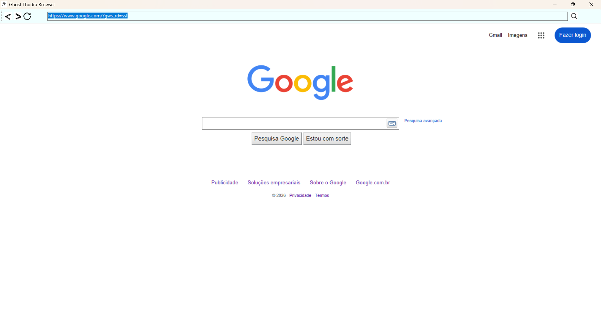

## Projeto Navegador Simples - Ghost Tundra Browser

Este é o meu navegador em C#, o Ghost Tundra Browser. Feito em uma aplicação Windows Forms, .NET Framework, utilizando-se do WebBrowser1.

O Ghost Tundra Browser tem as funcionalidades comum de qualquer outro navegador. Você pode pesquisar pela barra de endereço, voltar para a página anterior ou avançar e recarregar a página.

